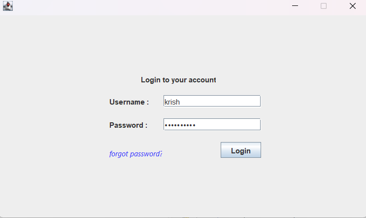
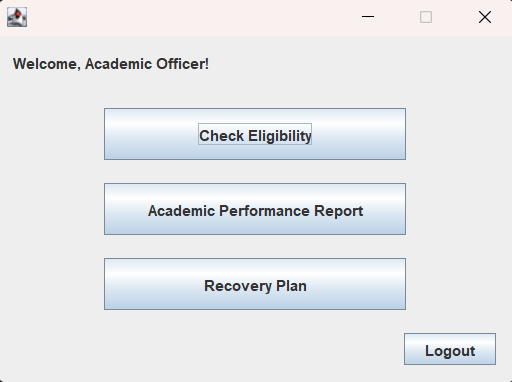
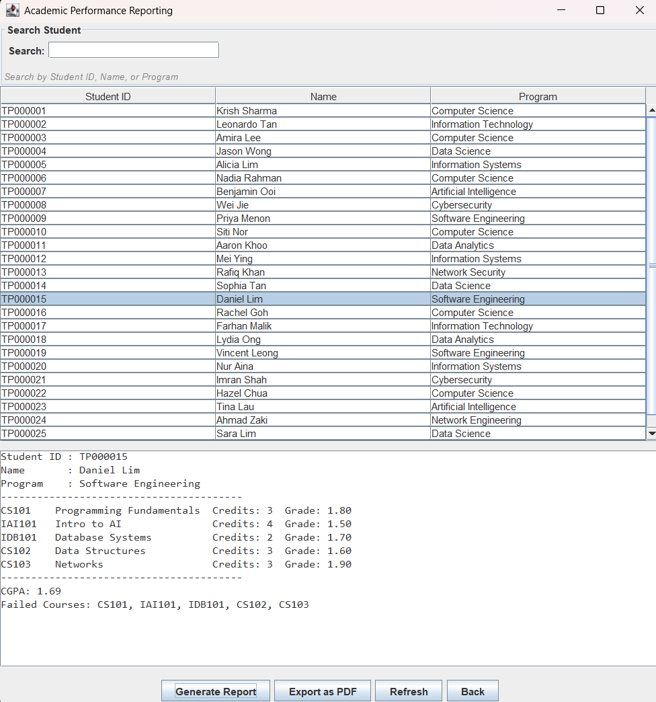
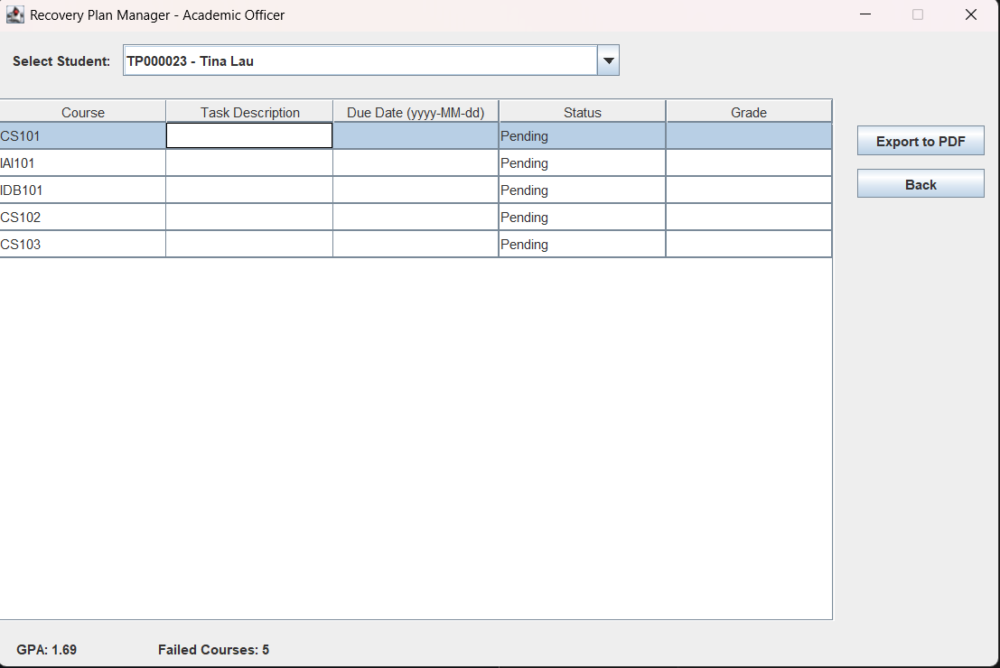
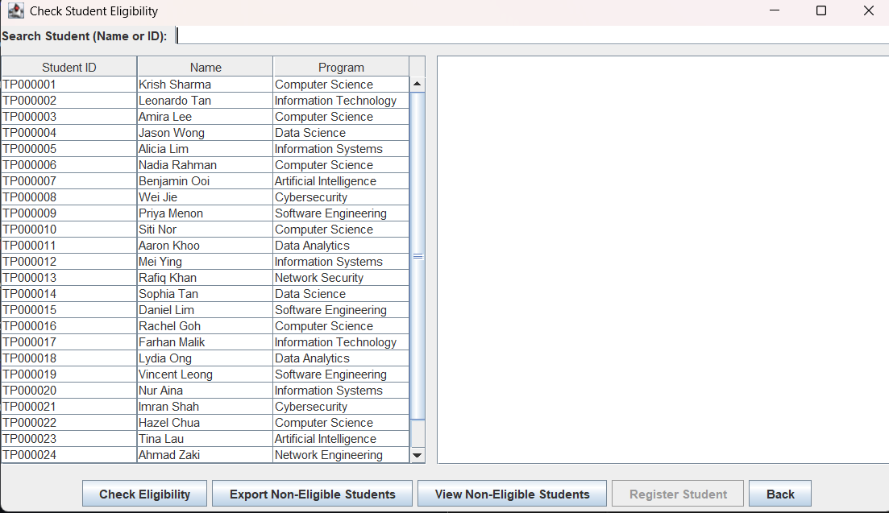

\# Course Recovery System (Java OOP Project)

&nbsp;Overview

The Course Recovery System is a Java-based desktop application developed using Object-Oriented Programming principles. The system manages students who require course recovery plans based on academic eligibility.

The project demonstrates strong implementation of core OOP concepts and multi-role system architecture.

\##  Key Features

\- Multi-role login system (Student, Academic Officer, System Admin)

\- Course eligibility checking

\- Academic report generation

\- Recovery plan creation with milestones

\- PDF export functionality

\- Email notification system

\- GUI-based system using Java Swing

## Data Storage

The system uses text files stored in the `resources/` directory
to simulate database functionality.

These files manage:
- User accounts
- Course records
- Recovery plans
- Academic reports

\## OOP Concepts Implemented

\- Encapsulation

\- Inheritance (User → Student / AcademicOfficer / SystemAdmin)

\- Polymorphism

\- Abstraction via Interfaces

\- Separation of Concerns (Models, UI, Utils, Auth layers)

\## Technologies Used

\- Java

\- Java Swing (GUI)

\- File Handling

\- OOP Design Principles

\## Project Structure

\- `models/` → Core data classes

\- `auth/` → Authentication and user management

\- `ui/` → GUI components

\- `utils/` → Helper services (PDF, Email, Reports)

##  Requirements

- Java 17
- Apache Maven (if building from command line)

##  Dependencies

All required dependencies (iText PDF, Jakarta Mail, Jakarta Activation)
are managed automatically through Maven.

No manual JAR downloads are required.

##  Important Folder Structure

The system uses text files stored inside the `Resources` folder
located in the project root directory.

Do NOT move or rename the `Resources` folder,
or the application may fail to locate required data files.

\## How To Run

1\. Clone repository

2\. Open in NetBeans / IntelliJ

3\. Run `OODJAssignment.java`

---

##  Application Screenshots

### Login Interface

Use the users.txt file for login information

### Academic Officer Dashboard

###  Academic Report Generation

###  Course Recovery Plan Interface

###  Eligibility Checking Module

---

Developed by Krish Sharma  

BSc Computer Science (AI)  

Asia Pacific University

